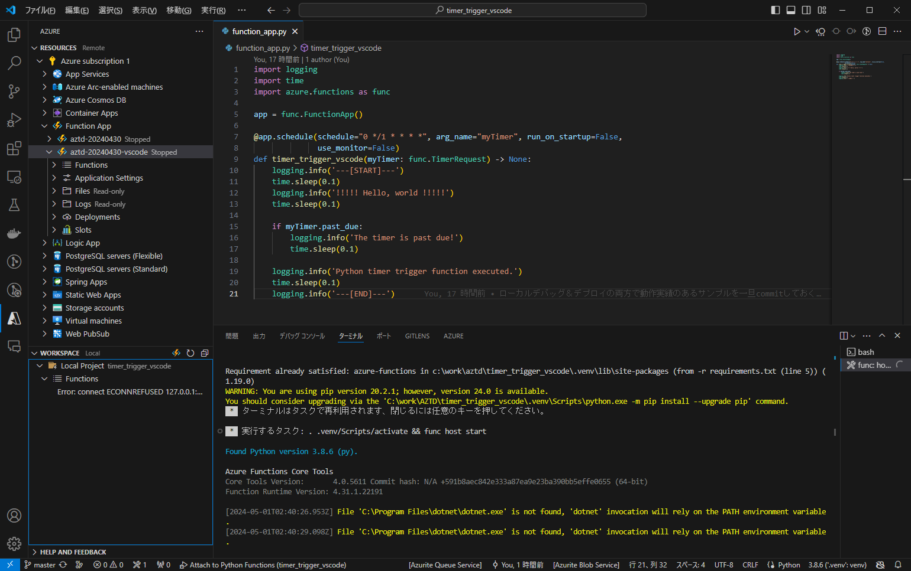

# Azure Functions: Timer Trigger in Python

## Timer Trigger

A timer trigger lets you run a function on a schedule.



## Using the Template

Following is an example code snippet for Timer Trigger using the [Python programming model V2](https://aka.ms/pythonprogrammingmodel) (currently in Preview).

```python
import datetime

import logging

import azure.functions as func

app = func.FunctionApp()

@app.function_name(name="mytimer")
@app.schedule(schedule="0 */5 * * * *", arg_name="mytimer", run_on_startup=True,
              use_monitor=False) 
def test_function(mytimer: func.TimerRequest) -> None:
    utc_timestamp = datetime.datetime.utcnow().replace(
        tzinfo=datetime.timezone.utc).isoformat()

    if mytimer.past_due:
        logging.info('The timer is past due!')

    logging.info('Python timer trigger function ran at %s', utc_timestamp)
```

To run the code snippet generated through the command palette, note the following:

- The function application is defined and named `app`.
- Confirm that the parameters within the trigger reflect values that correspond with your storage account.
- The name of the file must be `function_app.py`.

## Programming Model V2

The new programming model in Azure Functions Python delivers an experience that aligns with Python development principles, and subsequently with commonly used Python frameworks.

The improved programming model requires fewer files than the default model, and specifically eliminates the need for a configuration file (`function.json`). Instead, triggers and bindings are represented in the `function_app.py` file as decorators. Moreover, functions can be logically organized with support for multiple functions to be stored in the same file. Functions within the same function application can also be stored in different files, and be referenced as blueprints.

To learn more about using the new Python programming model for Azure Functions, see the [Azure Functions Python developer guide](https://aka.ms/pythondeveloperguide). Note that in addition to the documentation, [hints](https://aka.ms/functions-python-hints) are available in code editors that support type checking with PYI files.

To learn more about the new programming model for Azure Functions in Python, see [Programming Models in Azure Functions](https://aka.ms/functions-programming-models).
